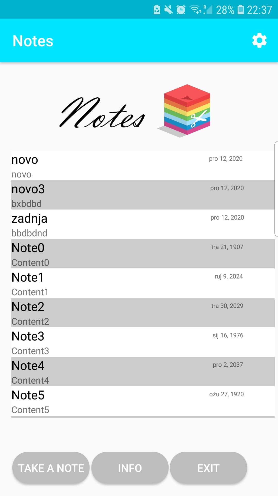
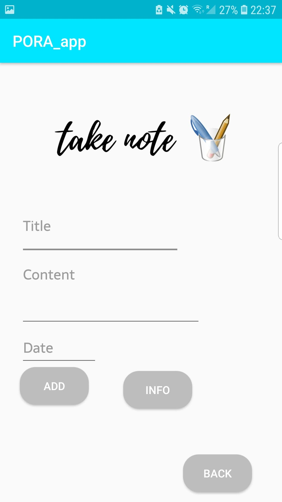

# Notes
Android app za spremanje zapisaka ili podsjetnika. 
Aplikacija omogucava:
* Dodavanje novog podjetnika 
* Brisanje vec dodanog podsjetnika sa liste 
* Uredjivanje vec dodanog podsjetnika u listi
                      
#### Dodavanje novog podsjetnika 
Novi podsjetnik dodajemo klikom na gumb `<Take Note>`. U novi podjetnik mozemo da dodamo: naslov, sadrzaj i datum. Datu obavezno mora biti formata dan/mjesec/godina

#### Brisanje podsjetnika
Podsjetnik mozemo obrisati klikom na podsjetnik u listi na pocetnom zaslonu

#### Uredjivanje podsetnika
Podsjetnik uredjujemo tako sto pritisnemo LongClick na neki od podsjetnika u listi, te nam se otvori aktivnost za uredjivanje
                                                                      

## Izgled aplikacije

|

